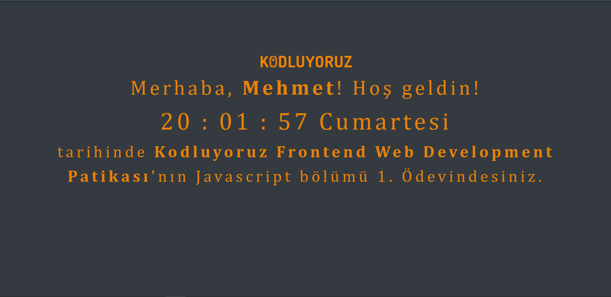

# Digital Clock with JavaScript

I have coded a digital clock with JavaScript for homework which is from <a href="https://www.patika.dev/egitimler/frontend-web-development-patikasi">Front-End Web Development Path</a>.

<a href="https://clock-app-eight.vercel.app">Visit Clock App</a>.

# Screenshot

